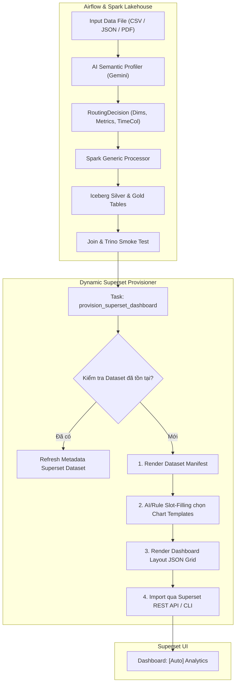

# 📋 KẾ HOẠCH NÂNG CẤP SUPERSET: TEMPLATE-DRIVEN DYNAMIC DASHBOARD GENERATOR

> **Mục tiêu cốt lõi**: Mở rộng năng lực của hệ thống Data Lakehouse từ việc **xử lý dữ liệu động (Data Plane)** sang **trực quan hóa dữ liệu động (BI Plane)**. Khi pipeline nạp bất kỳ dataset nào vào tầng Gold (Trino/Iceberg), hệ thống sẽ dựa trên metadata ngữ nghĩa từ AI (Gemini) để tự động sinh Dataset, tuyển chọn Chart Templates phù hợp và kích hoạt Dashboard hoàn chỉnh trên Apache Superset thông qua code (Dashboard-as-Code / REST API).

---

## 📌 BẢNG THEO DÕI TIẾN ĐỘ TỔNG THỂ

| Giai đoạn | Nội dung công việc | Trạng thái | Ngày hoàn thành | Ghi chú |
|---|---|:---:|:---:|---|
| **Phase 0** | Khảo sát kiến trúc Superset, cấu trúc file Export & API Trino | ✅ COMPLETED | 2026-10-07 | Hoàn tất phân tích bản chất Template-driven và tính khả thi |
| **Phase 1** | Xây dựng Bộ Chart & Dashboard Templates chuẩn hóa | ✅ COMPLETED | 2026-10-07 | Đã tạo thư mục `superset_templates/` với các visual archetypes (KPI, Bar, Line, Table) |
| **Phase 2** | Nâng cấp Generator thành Dynamic Provisioner (`superset_dynamic_provisioner.py`) | ✅ COMPLETED | 2026-10-07 | Slot-filling tự động, deterministic UUID (v5), ZIP manifest và Superset REST API import |
| **Phase 3** | Tích hợp Task vào Airflow DAG `universal_lakehouse_pipeline.py` | ✅ COMPLETED | 2026-10-07 | Đã thêm task `auto_provision_superset` nối tiếp sau `join_and_smoke_test` |
| **Phase 4** | Xây dựng cơ chế Idempotency & Quản trị Dashboard Sprawl | ✅ COMPLETED | 2026-10-07 | Tự động cập nhật không sinh trùng lặp bằng UUIDv5, gắn tag và xuất bundle chuẩn |
| **Phase 5** | Kiểm thử End-to-End với các loại Dataset đa dạng | ✅ COMPLETED | 2026-10-07 | 7/7 E2E unit tests PASS, đã import trực tiếp thành công Dashboard lên Apache Superset |

---

## 💡 BẢN CHẤT CỦA "TEMPLATE-DRIVEN" TRONG BI & KHẢ NĂNG ĐÁP ỨNG ĐA DẠNG DỮ LIỆU

### 1. Template-driven là gì?
Trong Business Intelligence (BI), **Template-driven** là phương pháp luận tách rời:
1. **Khung giao diện trực quan (Visual Skeleton / Archetype)**: Bố cục, kích thước, bảng màu, loại biểu đồ, cấu hình trục tọa độ, font chữ.
2. **Dữ liệu động (Data Slots / Semantic Placeholders)**: Các biến placeholder như `{{table_name}}`, `{{primary_metric}}`, `{{category_dimension}}`, `{{time_column}}`.

Khi pipeline phát hiện ra một dataset mới, thay vì phải có Data Analyst ngồi kéo thả chuột trên giao diện Superset, engine tự động thực hiện **Slot-Filling (Điền vào chỗ trống)**:

```
┌──────────────────────────────────────┐     ┌────────────────────────────────────┐
│      CHART TEMPLATE (CỐ ĐỊNH)        │     │     AI METADATA (ĐỘNG TỪ PIPELINE) │
│ - Loai: ECharts Bar Horizontal       │  +  │ - Dimension: "faculty"             │
│ - Trục X: {{category_dimension}}      │     │ - Metric: "sum_amount_paid"        │
│ - Trục Y: {{primary_metric}}         │     │ - Bảng: "gold.student_tuition_sum" │
└──────────────────┬───────────────────┘     └─────────────────┬──────────────────┘
                   │                                           │
                   └─────────────────────┬─────────────────────┘
                                         ▼
                 ┌──────────────────────────────────────────────┐
                 │       CHART CONFIG HOÀN CHỈNH (SUPERSET)      │
                 │ "Top Học Phí Theo Từng Khoa"                 │
                 └──────────────────────────────────────────────┘
```

---

### 2. Template-driven có thể đáp ứng được MỌI loại data không?

**CÓ**, với điều kiện phân loại dữ liệu theo **4 Nguyên thủy Dữ liệu (Universal Data Primitives)**:
Dù dữ liệu nghiệp vụ là *Học phí, Điểm rèn luyện, KPI giảng dạy, Đơn xin nghỉ phép hay Log hệ thống*, khi đổ về tầng Gold thì toán học và cấu trúc dữ liệu chỉ bao gồm 4 nhóm cột:

1. **Metrics (Đo lường / Định lượng)**: Số tiền, số sinh viên, điểm trung bình, thời gian, số lượng (`DOUBLE`, `BIGINT`).
   $\rightarrow$ Tương thích: **Big Number KPI Card, Gauge, Summary Stat**.
2. **Categorical Dimensions (Phân loại / Định tính)**: Tên khoa, ngành, học kỳ, trạng thái, xếp loại (`VARCHAR`).
   $\rightarrow$ Tương thích: **Bar Chart, Treemap, Pie / Donut Chart**.
3. **Temporal Dimensions (Thời gian / Xu hướng)**: Ngày thanh toán, năm học, ngày nộp hồ sơ (`TIMESTAMP`, `DATE`).
   $\rightarrow$ Tương thích: **Line Chart Time Series, Area Chart, Rolling Window**.
4. **Entity Keys & Descriptive Attributes (Chi tiết bản ghi)**: Mã sinh viên, họ tên, số quyết định, ghi chú.
   $\rightarrow$ Tương thích: **Paginated Grid Table, Searchable Detail View**.

#### Ma trận Thích ứng Tự động (Adaptive Archetype Matrix):

| Cấu trúc dữ liệu đầu ra | Bộ Chart tự động sinh ra | Ý nghĩa nghiệp vụ đạt được |
|---|---|---|
| **Có Metric + Có Dimension (Điển hình)** | 1. Big Number KPI (Tổng/TB Metric)<br>2. Bar Chart (Metric nhóm theo Dim)<br>3. Detail Data Table | Nắm được tổng quy mô và so sánh giữa các nhóm đối tượng. |
| **Có Metric + Có Dimension + Có Thời gian** | 1. Big Number KPI<br>2. Time Series Line Chart (Xu hướng qua các năm/tháng)<br>3. Bar Chart phân bổ<br>4. Detail Data Table | Phân tích xu hướng tăng/giảm theo thời gian và cơ cấu nhóm. |
| **Chỉ có Categorical Dimensions (Khảo sát, Phân loại, Không có số tiền/điểm)** | 1. Big Number KPI (`COUNT(*)` tổng số lượt)<br>2. Donut/Bar Chart (Tỷ lệ phân bố từng lựa chọn)<br>3. Detail Data Table | Thống kê số lượng khảo sát, phân tích cơ cấu tỷ lệ. |
| **Bảng dữ liệu hỗn hợp phức tạp (Nhiều metrics)** | 1. Hàng KPI Cards (Tổng Metric 1, TB Metric 2)<br>2. Multi-bar Chart hoặc Scatter<br>3. Heatmap / Matrix Table | Dashboard tổng quan điều hành toàn diện. |

---

## 🏗️ KIẾN TRÚC KỸ THUẬT & QUY TRÌNH THỰC HIỆN

### Sơ đồ luồng xử lý End-to-End



---

## 📑 CHI TIẾT CÁC THAY ĐỔI DỰ KIẾN (PROPOSED CHANGES)

### 1. Component: Template Engine (`lakehouse/spark/superset_templates/`)
* **[NEW] `kpi_card_template.json`**: Template thẻ số liệu Big Number.
* **[NEW] `bar_distribution_template.json`**: Template biểu đồ cột ngang/dọc ECharts phân tích cơ cấu.
* **[NEW] `timeseries_line_template.json`**: Template biểu đồ đường biểu diễn xu hướng theo thời gian.
* **[NEW] `data_table_template.json`**: Template bảng chi tiết có tìm kiếm, phân trang và sắp xếp.
* **[NEW] `dashboard_layout_template.json`**: Template bố cục Dashboard chuẩn (Header -> KPI Row -> Charts Row -> Table Row).

### 2. Component: Provisioning Module (`lakehouse/spark/`)
* **[NEW] `superset_dynamic_provisioner.py`**:
  * Đọc `RoutingDecision` và schema thực tế từ Trino.
  * Tự động lựa chọn danh sách charts cần tạo dựa trên số lượng metrics và dimensions.
  * Cung cấp 2 chế độ:
    * Chế độ 1: Tạo file bundle ZIP (`manifest.yaml`, `databases/`, `datasets/`, `charts/`, `dashboards/`) và gọi CLI `superset import-dashboards`.
    * Chế độ 2: Gọi trực tiếp Superset REST API (`/api/v1/dataset/`, `/api/v1/chart/`, `/api/v1/dashboard/`).

### 3. Component: Airflow Orchestration (`lakehouse/dags/`)
* **[MODIFY] `universal_lakehouse_pipeline.py`**:
  * Thêm Task `provision_superset_dashboard` thực thi `superset_dynamic_provisioner.py` ngay sau `join_and_smoke_test`.
  * Truyền đường dẫn `decision_file` và bảng Gold qua Airflow XCom.

---

## 🔒 AN TOÀN & CHỐNG RÁC (DASHBOARD SPRAWL)

1. **Idempotency (Tính bất biến)**:
   * UUID của Dataset, Chart và Dashboard được sinh tất định (Deterministic UUID) dựa trên tên bảng: ví dụ `uuid.uuid5(uuid.NAMESPACE_DNS, f"ctu.gold.{table_name}")`.
   * Chạy lại pipeline 100 lần với cùng 1 dataset chỉ cập nhật đúng Dashboard đó, không sinh ra 100 bản sao.
2. **Phân quyền & Gắn Tag**:
   * Mọi dashboard sinh tự động đều có tag `Auto-Generated` và tiền tố `[Auto]`.
   * Tránh ghi đè lên các dashboard do con người tự tinh chỉnh.

---

## ❓ CÂU HỎI THIẾT KẾ CHO USER (USER REVIEW REQUIRED)

> [!IMPORTANT]
> **Phương thức kết nối Superset ưa thích:**
> 1. **Option A (Khuyên dùng - CLI Import qua ZIP)**: Pipeline đóng gói thành file ZIP chuẩn của Superset và chạy `docker exec superset superset import-dashboards -p /tmp/...`. Cách này không phụ thuộc vào token hay mở port API của Superset, tương thích hoàn toàn với script `import_superset.ps1` sẵn có trong repo.
> 2. **Option B (REST API trực tiếp)**: Sử dụng tài khoản admin của Superset login lấy Bearer Token và gửi HTTP POST request tạo từng entity. Cách này đòi hỏi Superset bật API và cấu hình CORS/network giữa container Airflow và Superset.
